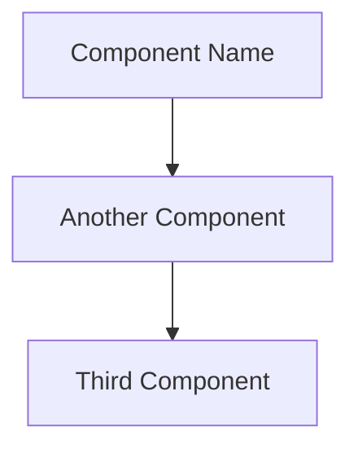
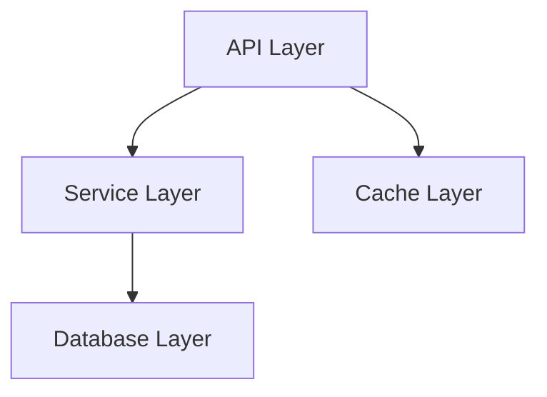
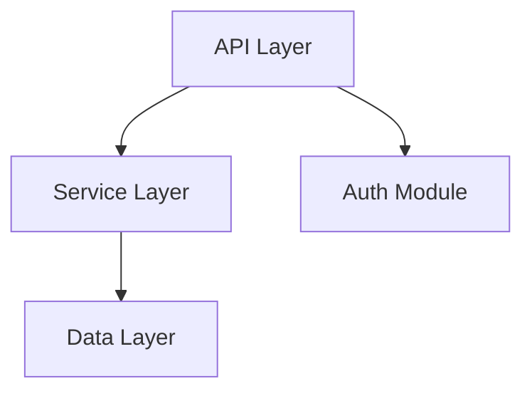

# Role: Senior Software Architect & Tooling Expert

# Task: Implement "ProjectOracle" - An MCP Server for Intelligent Project Analysis

## Background
ProjectOracle is a tool designed to help AI assistants and developers rapidly understand any codebase. It scans a project, extracts its structural skeleton using native AST parsers, and generates a comprehensive `.ProjectOracle` analysis report in the root directory.

---

## Core Requirements (MVP - Priority Ordered)

### [P0 - Must Have] 1. Project Scanning (Phase 1)

**Objectives**:
- Respect `.gitignore` rules using the `pathspec` library
- Detect primary tech stack from root configuration files
- Generate a structured directory tree

**Implementation Details**:
- **Ignore Rules Strategy**:
  - **Priority 1**: Load `.gitignore` BEFORE any file I/O operations
  - **Priority 2**: Apply default ignore patterns even if no `.gitignore` exists
  - **Priority 3**: Merge user patterns with defaults
  
- **Default Ignore Patterns** (Always applied):
  ```python
  DEFAULT_IGNORES = [
      'node_modules/', 'venv/', '.venv/', 'env/',
      '__pycache__/', '*.pyc', '*.pyo', '*.pyd',
      '.git/', '.svn/', '.hg/',
      'dist/', 'build/', 'target/', 'out/',
      '*.egg-info/', '.pytest_cache/', '.tox/',
      'coverage/', '.coverage', 'htmlcov/',
      'logs/', '*.log', '.DS_Store'
  ]
  ```

- **Tech Stack Detection** (Enhanced Multi-Stack Support):
  
  **Single-Stack Projects**: Check for these files in order:
  1. `package.json` → Node.js/JavaScript
  2. `requirements.txt` or `pyproject.toml` → Python
  3. `go.mod` → Go
  4. `Cargo.toml` → Rust
  5. `pom.xml` or `build.gradle` → Java
  
  **Multi-Language Projects** (e.g., Django + React):
  ```python
  def detect_tech_stacks(self) -> list[TechStack]:
      """Detect all tech stacks in project (supports multiple)"""
      stacks = []
      
      # Check for multiple stacks
      if self._has_file('package.json'):
          stacks.append(TechStack.NODEJS)
      
      if self._has_file('requirements.txt') or self._has_file('pyproject.toml'):
          stacks.append(TechStack.PYTHON)
      
      if self._has_file('go.mod'):
          stacks.append(TechStack.GO)
      
      # etc.
      return stacks
  ```
  
  **Monorepo Detection** (P2 Feature):
  ```python
  def detect_monorepo(self) -> Optional[MonorepoConfig]:
      """Detect if project is a monorepo and identify workspaces"""
      
      # Check for monorepo markers
      if self._has_file('pnpm-workspace.yaml'):
          return self._parse_pnpm_workspaces()
      
      if self._has_file('lerna.json'):
          return self._parse_lerna_config()
      
      if self._has_file('nx.json'):
          return self._parse_nx_config()
      
      # Turborepo
      if self._has_file('turbo.json'):
          return self._parse_turbo_config()
      
      # Poetry workspaces (Python)
      if self._has_file('pyproject.toml'):
          config = self._parse_toml('pyproject.toml')
          if 'tool.poetry.group' in config or 'tool.setuptools' in config:
              return MonorepoConfig(type='python-monorepo')
      
      return None
  ```
  
  **Monorepo Report Format** (if detected):
  ```markdown
  ## 1. 🏗️ Foundation
  - **Project Type**: Monorepo (pnpm workspaces)
  - **Workspaces**: 
    - `packages/frontend` (React 18.2)
    - `packages/backend` (Node.js + Express)
    - `packages/shared` (TypeScript utilities)
  - **Workspace Dependencies**: 
    - frontend → shared
    - backend → shared
  ```

- **Directory Tree Generation**: 
  - Maximum depth: 4 levels
  - Use directory pruning in `os.walk()` to skip ignored folders entirely
  - Format: Plain text tree with file counts per directory
  - Example:
    ```
    src/ (12 files)
    ├── auth/ (3 files)
    │   ├── user.py
    │   └── token.py
    └── main.py
    ```

**Performance Optimization**:
- **Pre-scan**: Load all ignore rules before file traversal
- **Directory Pruning**: Modify `dirs` list in `os.walk()` to skip ignored directories
- **Progress Logging**: Log every 1,000 files scanned
- **Target**: 1,000+ files/second scan rate

**Safety Constraints**:
- **Symbolic Links**: Do NOT follow (set `followlinks=False`)
- **Max Files**: Limit to 5,000 files total
- **File Size**: Skip files > 500KB
- **Sensitive Files**: Never read files matching:
  - `.env`, `.env.*`, `*.env`
  - `*secret*`, `*password*`, `*credential*`, `*key*` (case-insensitive)
  - `id_rsa`, `*.pem`, `*.key`, `*.crt`, `*.p12`
  - Directories: `.aws/`, `.ssh/`, `.gnupg/`

**File Limit Handling**:
- **If files ≤ 5,000**: Analyze all files
- **If files > 5,000**: 
  - Use intelligent sampling (prioritize entry points, config files, core modules)
  - Add warning to report: "Partial analysis - 5,000 of X files analyzed"
  - Suggest improving `.gitignore` or increasing `--max-files` limit

**File Prioritization Algorithm** (when sampling):
```python
Priority Score:
+ 1000: Entry files (main.py, app.py, index.js, server.js)
+ 500:  Config files (settings.py, config.py, .env.example)
+ 100:  Core directories (src/, lib/, app/, core/)
+ (10 - depth) * 10: Shallower files ranked higher
- 50:   Test files (containing 'test' in path)
```

**Entry Point Detection Strategy** (Enhanced Multi-Method Approach):

To avoid false positives from simple filename matching, use a layered detection strategy:

```python
Priority 1 - Configuration Files (Highest Confidence):
+ Check pyproject.toml [tool.poetry.scripts] or [project.scripts]
+ Check setup.py entry_points
+ Check package.json "main" or "bin" fields

Priority 2 - Execution Markers (High Confidence):
+ Files containing 'if __name__ == "__main__"' block
+ Files with FastAPI/Flask app initialization (app = FastAPI())
+ Files with Django WSGI application

Priority 3 - Naming Conventions (Medium Confidence):
+ main.py, app.py, server.py, index.js, server.js
+ __main__.py in package directories

Priority 4 - Directory Context (Low Confidence):
+ Executable files in bin/ or scripts/ directories
```

---

### [P0 - Must Have] 2. Native AST Symbol Extraction (Phase 2)

**Primary Language: Python**

Use Python's native `ast` module to extract:

**For Classes**:
- Name
- Base classes (inheritance chain)
- Decorators (e.g., `@dataclass`)
- Public methods only (exclude methods starting with `_`)

**For Functions**:
- Name
- Arguments with type hints (if present)
- Return type annotation (if present)
- Decorators (e.g., `@staticmethod`, `@property`)

**For Docstrings**:
- Extract **first line only** (summary sentence)

**For Imports** (Simplified Three-Category Strategy):

**The Challenge**: Python's import system is extremely flexible (relative vs absolute, dynamic imports, conditional imports). Static analysis cannot be 100% accurate.

**Our Solution**: Classify imports into three categories and let the LLM resolve ambiguity.

**Category 1: Internal (Confirmed)**:
- Any import starting with `.` (relative import)
- Example: `from ..auth import User`, `from . import utils`

**Category 2: External (Confirmed)**:
- Imports found in `requirements.txt` or `pyproject.toml`
- Imports in Python's standard library (maintain a stdlib list)
- Examples: `fastapi`, `pydantic`, `os`, `sys`

**Category 3: Uncertain**:
- Everything else that could be either internal or external
- Let the LLM infer based on directory structure
- Examples: `config`, `helpers`, `services`

**Implementation Approach**:
```python
def classify_import(self, import_name: str) -> str:
    """
    Returns: "internal" | "external" | "uncertain"
    """
    # Rule 1: Relative imports are always internal
    if import_name.startswith('.'):
        return "internal"
    
    # Rule 2: Check against Python stdlib
    if import_name.split('.')[0] in PYTHON_STDLIB:
        return "external"  # Don't include in output
    
    # Rule 3: Check against requirements.txt
    if self._in_requirements(import_name):
        return "external"
    
    # Rule 4: Everything else is uncertain
    return "uncertain"
```

**Output Structure** (JSON):
```json
{
  "file": "src/auth/user.py",
  "classes": [
    {
      "name": "UserAuthenticator",
      "bases": ["BaseAuthenticator"],
      "decorators": [],
      "methods": [
        {
          "name": "verify_token",
          "args": ["self", "token: str"],
          "returns": "bool",
          "decorators": [],
          "docstring": "Verify JWT token validity"
        }
      ]
    }
  ],
  "functions": [
    {
      "name": "hash_password",
      "args": ["password: str", "salt: Optional[str] = None"],
      "returns": "str",
      "decorators": [],
      "docstring": "Generate bcrypt hash for password"
    }
  ],
  "imports": {
    "internal_confirmed": ["..models", ".utils.crypto"],
    "external_confirmed": ["fastapi", "pydantic", "hashlib"],
    "uncertain": ["config", "helpers"],
    "aliased": {"pd": "pandas", "np": "numpy", "F": "torch.nn.functional"}
  }
}
```

**Import Alias Tracking** (New Feature):

Track `import X as Y` and `from X import Y as Z` patterns to help AI assistants understand code that uses aliases:

```python
def extract_import_aliases(self, node: ast.Import | ast.ImportFrom) -> dict[str, str]:
    """
    Extract import aliases for better code comprehension.
    
    Examples:
    - import pandas as pd → {"pd": "pandas"}
    - from torch.nn import functional as F → {"F": "torch.nn.functional"}
    """
    aliases = {}
    
    if isinstance(node, ast.Import):
        for alias in node.names:
            if alias.asname:
                aliases[alias.asname] = alias.name
    
    elif isinstance(node, ast.ImportFrom):
        module = node.module or ""
        for alias in node.names:
            if alias.asname:
                full_name = f"{module}.{alias.name}" if module else alias.name
                aliases[alias.asname] = full_name
    
    return aliases
```

**Why This Matters**: 
- AI assistants can understand that `pd.DataFrame` refers to `pandas.DataFrame`
- Critical for data science projects (pandas, numpy, torch)
- Helps with code navigation suggestions

**Important Note for LLM Phase**: When sending to LLM, include this instruction:
```
The following imports are marked as "uncertain". Based on the directory tree provided, 
determine which are likely internal modules:
- uncertain: ["config", "helpers", "services"]

If a name matches a directory in the tree (e.g., "config/" exists), classify it as internal.
```

**Secondary Languages** (Optional for MVP):
- JavaScript/TypeScript: Provide a placeholder `JSParser` class
- Mark as **[P1 - Next Iteration]**

**Error Handling**:
- **Syntax Errors**: Log file path to `.ProjectOracle.error.log`, skip file, continue
- **Encoding Issues**: Try UTF-8, fallback to latin-1, skip if both fail
- **Import Errors**: If `requirements.txt` is missing, all non-stdlib imports → uncertain

---

### [P1 - Should Have] 3. Incremental Update Logic (Lock System)

**Note**: Can be deferred to v1.1 if time-constrained. Implement basic version first.

**Mechanism**:
- Create a `.ProjectOracle.lock` file (JSON format)
- Store for each analyzed file:
  ```json
  {
    "version": "1.0.0",
    "last_updated": "2026-01-20T14:30:00Z",
    "files": {
      "src/main.py": {
        "hash": "a3f5c9d2e1b4...",
        "last_analyzed": "2026-01-20T14:30:00Z",
        "symbol_summary": { /* cached extracted symbols */ }
      }
    }
  }
  ```

**Process**:
1. Compute SHA-256 hash for every scanned file
2. Compare with lock file:
   - If hash unchanged → reuse cached summary (skip AST parsing)
   - If changed or new → re-analyze and update lock
3. Save updated lock file after analysis

**Benefits**:
- Avoid re-parsing unchanged files
- Dramatically reduce LLM token costs on subsequent runs
- Track incremental project changes over time

---

### [P0 - Must Have] 4. Hierarchical Summarization (LLM Integration)

**Strategy**: Send minimal context to LLM to infer high-level understanding.

**Input to LLM** (in this order):
1. **Directory Tree** (text format, max 4 levels)
2. **Extracted Symbols** (JSON of all classes/functions)
3. **Entry Point Content** (full content of `main.py`, `app.py`, or equivalent)

**LLM Prompt Template**:

```
You are analyzing a {language} project. Based on the following information, generate insights about its architecture and purpose.

## 1. Directory Tree (up to 4 levels):
```
{tree_content}
```

## 2. Extracted Symbols (classes/functions):
```json
{symbols_json}
```

## 3. Entry Point Content:
```python
{main_file_content}
```

## 4. Uncertain Imports Resolution:
The following imports could not be definitively classified as internal or external.
Based on the directory tree, determine which are likely internal project modules:

Uncertain imports: {uncertain_imports}

For each uncertain import, check if a matching directory or file exists in the tree.
Example: If "config" is uncertain and "src/config/" exists in tree → classify as internal.

---

**Generate a JSON response with this exact schema**:
```json
{
  "business_domain": "Brief description (1 sentence, e.g., 'E-commerce order management system')",
  "architecture_pattern": "Detected pattern (e.g., 'Clean Architecture', 'MVC', 'Microservices')",
  "core_modules": [
    {
      "module": "auth",
      "purpose": "User authentication and authorization",
      "key_components": ["UserAuthenticator", "JWTService"],
      "responsibilities": "Handles login, logout, token validation"
    }
  ],
  "data_flow": "High-level description of typical request → response flow (2-3 sentences)",
  "entry_points": ["src/main.py creates FastAPI app with routes from src/api/"],
  "fragile_points": ["Components lacking tests", "Areas with no documentation", "Deprecated patterns"],
  "resolved_uncertain_imports": {
    "config": "internal",
    "helpers": "internal", 
    "services": "internal"
  }
}
```

**Critical Requirements**:
- Base ALL conclusions ONLY on provided symbols and structure
- If uncertain about anything, prefix with "Inferred: "
- DO NOT hallucinate components not present in the symbol list
- Prioritize accuracy over completeness

**Self-Validation Step** (IMPORTANT):
After generating your analysis, perform a self-check:
1. List all components you mentioned in "core_modules"
2. Verify each component exists in the provided symbol list
3. If a component is NOT in the symbol list, mark it clearly:
   - Example: `"key_components": ["PaymentProcessor", "StripeAPI (Inferred - not found in code)"]`
```

**Fallback Strategy**:
- If LLM response is malformed JSON:
  1. Retry once with simplified prompt (only tree + symbols, remove imports section)
  2. If still fails → generate template-based report with placeholder text
  3. Log error details to `.ProjectOracle.error.log`

**Token Budget**:
- Target: Keep input under 8,000 tokens
- If symbols exceed 6,000 tokens → prioritize:
  1. Entry point file symbols
  2. Files in `src/` or `lib/` directories  
  3. Files with most classes/functions (top 50%)

---

### [P0 - Must Have] 5. Output Generation (Phase 3)

**Target File**: `.ProjectOracle` (Markdown format)

**Backup Strategy**:
- Before overwriting, create `.ProjectOracle.backup`
- Only overwrite if:
  - New analysis differs by > 20% (use text diff ratio)
  - OR user passes `--force` flag

#### 5.1 Architecture Diagram Generation (Mermaid)

**The Challenge**: LLMs frequently generate invalid Mermaid syntax (mismatched brackets, complex syntax).

**Three-Layer Defense Strategy**:

**Layer 1: Strict LLM Constraints**

Add this section to the LLM prompt:

```
## Architecture Diagram Requirements (STRICT SYNTAX)

**You MUST generate a Mermaid diagram using ONLY this syntax**:



**Mandatory Rules**:
1. Use ONLY `graph TD` (top-down direction)
2. Node IDs: Single uppercase letter ONLY (A, B, C, D, E, F, G, H)
3. Labels: Use `[Square Brackets]` ONLY - NO curly braces, NO round brackets
4. Connections: Use `-->` ONLY (no fancy arrows like `==>` or `-.->`)
5. Maximum 8 nodes per diagram
6. NO styling commands (no `style`, `class`, `classDef`)
7. NO subgraphs
8. NO special characters in labels (use plain text only)

**Valid Example**:


**FORBIDDEN Syntax** (will cause validation failure):
- ❌ Curly braces: `A{Decision Point}`
- ❌ Round brackets: `A(Start/End)`
- ❌ Diamond: `A<Decision>`
- ❌ Complex arrows: `A ==> B`, `A -.-> B`
- ❌ Styling: `style A fill:#f9f`
- ❌ Subgraphs: `subgraph X ... end`

**Alternative Option**: If the architecture is too complex for a simple Mermaid diagram:
- Set `"architecture_diagram": null` in your JSON response
- Provide a detailed text description in the `architecture_pattern` field instead
- The system will auto-generate a text-based flow representation
```

**Layer 2: Post-Processing Validator**

```python
class MermaidValidator:
    """Validates and attempts to fix common Mermaid syntax errors"""
    
    ALLOWED_NODE_IDS = set('ABCDEFGH')
    
    def validate(self, mermaid_code: str) -> tuple[bool, str, str]:
        """
        Returns: (is_valid, corrected_code_or_error, error_message)
        """
        if not mermaid_code or not mermaid_code.strip():
            return False, "", "Empty Mermaid code"
        
        lines = mermaid_code.strip().split('\n')
        errors = []
        
        # Check 1: Must start with 'graph TD'
        if not lines[0].strip().startswith('graph TD'):
            return False, "", "Missing 'graph TD' header"
        
        # Check 2: Validate each line
        for i, line in enumerate(lines[1:], start=2):
            line = line.strip()
            if not line:
                continue
            
            # Check for forbidden syntax
            if '{' in line or '}' in line:
                errors.append(f"Line {i}: Curly braces not allowed")
            if '(' in line or ')' in line:
                errors.append(f"Line {i}: Round brackets not allowed")
            if '==>' in line or '.->' in line:
                errors.append(f"Line {i}: Complex arrows not allowed")
            
            # Check bracket matching
            if '[' in line:
                if line.count('[') != line.count(']'):
                    errors.append(f"Line {i}: Mismatched square brackets")
            
            # Check node IDs (if it's a connection line)
            if '-->' in line:
                parts = line.split('-->')
                for part in parts:
                    node_id = part.strip().split('[')[0].strip()
                    if node_id and node_id not in self.ALLOWED_NODE_IDS:
                        errors.append(f"Line {i}: Invalid node ID '{node_id}' (use A-H only)")
        
        if errors:
            return False, "", "; ".join(errors)
        
        return True, mermaid_code, ""
    
    def auto_fix(self, mermaid_code: str) -> tuple[bool, str]:
        """
        Attempt to automatically fix common Mermaid syntax errors.
        
        Returns: (success, fixed_code)
        """
        import re
        
        fixed = mermaid_code
        
        # Fix 1: Replace round brackets with square brackets
        # A(Component Name) → A[Component Name]
        fixed = re.sub(r'([A-H])\(([^)]+)\)', r'\1[\2]', fixed)
        
        # Fix 2: Replace curly braces with square brackets
        # A{Decision} → A[Decision]
        fixed = re.sub(r'([A-H])\{([^}]+)\}', r'\1[\2]', fixed)
        
        # Fix 3: Replace complex arrows with simple arrows
        fixed = fixed.replace('==>', '-->').replace('.->', '-->')
        fixed = fixed.replace('-.>', '-->').replace('==>>', '-->')
        
        # Fix 4: Remove styling commands (entire lines)
        fixed = re.sub(r'^\s*style\s+.*$', '', fixed, flags=re.MULTILINE)
        fixed = re.sub(r'^\s*classDef\s+.*$', '', fixed, flags=re.MULTILINE)
        fixed = re.sub(r'^\s*class\s+.*$', '', fixed, flags=re.MULTILINE)
        
        # Fix 5: Remove subgraphs (convert to comments)
        fixed = re.sub(r'^\s*subgraph\s+.*$', '%%', fixed, flags=re.MULTILINE)
        fixed = re.sub(r'^\s*end\s*$', '%%', fixed, flags=re.MULTILINE)
        
        # Fix 6: Remove empty lines
        fixed = '\n'.join(line for line in fixed.split('\n') if line.strip())
        
        # Validate the fixed version
        is_valid, _, error_msg = self.validate(fixed)
        
        if is_valid:
            logger.info("Mermaid auto-fix successful")
            return True, fixed
        else:
            logger.warning(f"Mermaid auto-fix failed: {error_msg}")
            return False, mermaid_code
    
    def generate_fallback_text_diagram(self, modules: list[dict]) -> str:
        """Generate text-based architecture description when Mermaid fails"""
        text = "**Architecture Flow** (Text Representation):\n\n"
        for i, module in enumerate(modules[:8]):  # Limit to 8 modules
            indent = "  " * min(i, 3)
            arrow = "└─" if i > 0 else "┌─"
            text += f"{indent}{arrow} **{module.get('module', 'Unknown')}**: "
            text += f"{module.get('purpose', 'No description')}\n"
        return text
```

**Layer 3: Fallback Mechanism in Report Generation**

```python
def generate_architecture_section(self, analysis: dict) -> str:
    """Generate architecture section with Mermaid or text fallback"""
    
    mermaid_code = analysis.get("architecture_diagram", "")
    
    if mermaid_code:
        validator = MermaidValidator()
        is_valid, corrected, error_msg = validator.validate(mermaid_code)
        
        if is_valid:
            # Validation passed - use as-is
            return f"**Detected Pattern**: {analysis.get('architecture_pattern', 'Unknown')}\n\n```mermaid\n{corrected}\n```\n"
        else:
            # Validation failed - try auto-fix
            logger.warning(f"Mermaid validation failed: {error_msg}. Attempting auto-fix...")
            success, fixed_code = validator.auto_fix(mermaid_code)
            
            if success:
                logger.info("Auto-fix successful, using corrected Mermaid diagram")
                return f"**Detected Pattern**: {analysis.get('architecture_pattern', 'Unknown')}\n\n```mermaid\n{fixed_code}\n```\n"
            else:
                logger.warning("Auto-fix failed, falling back to text diagram")
                # Fall through to text generation
    
    # Fallback: Generate text-based diagram
    modules = analysis.get("core_modules", [])
    text_diagram = validator.generate_fallback_text_diagram(modules)
    
    return f"**Detected Pattern**: {analysis.get('architecture_pattern', 'Unknown')}\n\n{text_diagram}\n"
```

#### 5.2 Complete File Structure

**File Structure**:

```markdown
# 🔮 ProjectOracle Report

> **Generated**: 2026-01-20 14:30:00 UTC  
> **Project Hash**: a3f5c9d2  
> **Analyzer Version**: 1.0.0
> **Analysis Scope**: {scope_note}

{scope_note} examples:
- "Full analysis - 847 files scanned"
- "Partial analysis - 5,000 of 12,483 files analyzed (intelligent sampling applied)"

---

## 1. 🏗️ Foundation (The Tech Stack)

- **Primary Language**: Python 3.10
- **Framework**: FastAPI 0.104.1
- **Database**: PostgreSQL (inferred from `psycopg2` dependency)
- **Entry Point**: `src/main.py`
- **Configuration Files**: 
  - `requirements.txt` (dependencies)
  - `.env.example` (environment variables template)

---

## 2. 🏛️ Architecture Skeleton

{mermaid_or_text_diagram}

**Directory Responsibilities**:
- `src/api/`: HTTP request handlers and route definitions
- `src/services/`: Core business logic implementation
- `src/database/`: ORM models and database migrations
- `src/auth/`: Authentication and authorization logic
- `src/utils/`: Shared utility functions

---

## 3. 🗺️ Logic Map (Core Modules)

| Module | Key Components | Primary Responsibilities |
|--------|----------------|--------------------------|
| **auth** | `UserAuthenticator`, `JWTService` | Handle user login/logout, token generation & validation |
| **orders** | `OrderProcessor`, `PaymentHandler` | Process customer orders, integrate with payment gateway |
| **inventory** | `StockManager`, `WarehouseSync` | Track product availability, sync with warehouse system |

**Key Data Flow**:
1. HTTP Request → API Route (`src/api/orders.py`)
2. Route calls Service (`OrderProcessor.create_order()`)
3. Service validates via Auth (`UserAuthenticator.verify_token()`)
4. Service updates Database (`Order` model in `src/database/models.py`)
5. Service triggers External API (`PaymentHandler.charge()`)
6. Response returned to client

---

## 4. 📋 Data Contracts

**Core Models** (from `src/database/models.py`):
- `User`: User account and profile information
- `Order`: Customer order with line items
- `Product`: Inventory item details

**Primary API Endpoints** (from `src/api/`):
- `POST /v1/auth/login`: Authenticate user, returns JWT
- `POST /v1/orders`: Create new order (requires auth)
- `GET /v1/orders/{id}`: Retrieve order details
- `GET /v1/inventory`: List available products

---

## 5. 🤖 AI Development Guide

**For AI Assistants working on this codebase:**

### Quick Start
```bash
# Setup environment
python -m venv venv
source venv/bin/activate  # or `venv\Scripts\activate` on Windows
pip install -r requirements.txt

# Run application
python src/main.py
```

### Development Patterns
1. **Adding a new feature**: 
   - Create route in `src/api/`
   - Implement logic in `src/services/`
   - Add models to `src/database/models.py` if needed
2. **Authentication**: All protected routes use `@require_auth` decorator
3. **Database changes**: Create migration in `src/database/migrations/`

### Code Style
- Follow PEP 8 conventions
- Use type hints for all function signatures
- Write docstrings for public classes and functions

### Fragile Points ⚠️
- `src/utils/legacy_parser.py`: No unit tests, modify with caution
- `src/integrations/payment.py`: Hardcoded API keys (should use env vars)
- `src/database/migrations/`: Manual migrations, no automated rollback

### Testing Strategy
- Unit tests in `tests/unit/`
- Integration tests in `tests/integration/`
- Run with: `pytest tests/`

---

## 6. 📊 Project Statistics

- **Total Files Scanned**: 3,421
- **Total Files Analyzed**: 847
- **Lines of Code**: ~3,200 (Python only)
- **Classes**: 23
- **Functions**: 156
- **Test Coverage**: Unknown (no coverage report found)

---

## 7. 🔄 Next Steps for Improvement

1. Add unit tests for `auth` module (currently 0% coverage)
2. Move hardcoded configuration to environment variables
3. Implement API rate limiting
4. Add database connection pooling
5. Document all API endpoints with OpenAPI/Swagger

---

## 8. 📝 Analysis Notes

**Sampling Applied**: This project contains 12,483 files. Intelligent sampling prioritized:
- Entry points and configuration files
- Files in core directories (src/, lib/, app/)
- Files closer to project root

**To analyze all files**: Improve `.gitignore` to exclude build artifacts and logs, or use `--max-files 15000` flag.

**Import Resolution**: {X} uncertain imports were resolved by matching against directory structure.

---

*This report was generated automatically by ProjectOracle v1.0.0. For questions or updates, re-run the analyzer with `--force` flag.*
```

---

## Configuration Management

### Configuration File Support

ProjectOracle supports configuration via `.projectoracle.config.json` in the project root or `[tool.projectoracle]` section in `pyproject.toml`.

**Configuration Schema** (`.projectoracle.config.json`):
```json
{
  "version": "1.0",
  "scan": {
    "max_files": 5000,
    "max_depth": 4,
    "max_file_size_kb": 500,
    "scan_timeout_seconds": 300,
    "follow_symlinks": false,
    "workers": 4,
    "custom_ignore_patterns": ["*.md", "docs/", "examples/"]
  },
  "analysis": {
    "include_tests": false,
    "detect_fragile_points": true,
    "generate_mermaid": true
  },
  "llm": {
    "provider": "anthropic",
    "model": "claude-3-5-sonnet-20241022",
    "max_input_tokens": 8000,
    "max_cost_usd": 0.50,
    "timeout_seconds": 30,
    "retry_attempts": 1
  },
  "output": {
    "backup_enabled": true,
    "diff_threshold_percent": 20,
    "keep_history": 5,
    "atomic_write": true
  }
}
```

**Alternative: pyproject.toml**:
```toml
[tool.projectoracle]
max_files = 5000
max_depth = 4

[tool.projectoracle.llm]
provider = "anthropic"
model = "claude-3-5-sonnet-20241022"
max_cost_usd = 0.50
```

**Configuration Loading Priority**:
1. CLI flags (highest priority)
2. `.projectoracle.config.json` in project root
3. `pyproject.toml` [tool.projectoracle] section
4. Default built-in values (lowest priority)

**Implementation**:
```python
class ConfigManager:
    DEFAULT_CONFIG = {
        "scan": {"max_files": 5000, "max_depth": 4, "workers": 4},
        "llm": {"provider": "anthropic", "max_cost_usd": 0.50},
        "output": {"backup_enabled": True}
    }
    
    def load(self, project_root: Path) -> dict:
        """Load config with priority: CLI > .projectoracle.config.json > pyproject.toml > defaults"""
        config = copy.deepcopy(self.DEFAULT_CONFIG)
        
        # Try pyproject.toml first
        if (pyproject := project_root / "pyproject.toml").exists():
            config = self._merge_config(config, self._load_from_toml(pyproject))
        
        # Override with .projectoracle.config.json
        if (config_file := project_root / ".projectoracle.config.json").exists():
            config = self._merge_config(config, self._load_from_json(config_file))
        
        return config
```

---

## Technical Implementation Stack

- **Language**: Python 3.10+
- **MCP Framework**: `mcp` (Python SDK)
- **Core Dependencies** (with version constraints):
  ```toml
  [tool.poetry.dependencies]
  python = "^3.10"
  mcp = "^0.9.0"
  pathspec = "^0.11.0"      # .gitignore parsing
  pydantic = "^2.0.0"        # Data validation
  anthropic = "^0.18.0"      # Claude API client
  tomli = "^2.0.0"           # TOML parsing (Python <3.11)
  aiofiles = "^23.0.0"       # Async file I/O (optional)
  ```
  
- **Built-in Modules**:
  - `ast`: Python AST parsing
  - `hashlib`: File hashing
  - `difflib`: Text diff calculation
  - `concurrent.futures`: Thread pool for parallel processing
  - `asyncio`: Async I/O operations

**Optional Dependencies** (for future):
- `tree-sitter = "^0.20.0"`: Multi-language AST parsing (P1 priority)
- `pygments = "^2.15.0\"`: Syntax highlighting for code snippets
- `tiktoken = "^0.5.0"`: Accurate token counting for cost estimation

---

## Performance & Concurrency Strategy

### Concurrent File Processing

For large projects (>1000 files), use parallel processing to improve scan performance:

**Implementation Approach**:
```python
from concurrent.futures import ThreadPoolExecutor, as_completed
import asyncio

class Scanner:
    def __init__(self, root_path: str, max_files: int = 5000, workers: int = 4):
        self.root_path = Path(root_path)
        self.max_files = max_files
        self.workers = workers  # Number of parallel workers
    
    def get_scannable_files_parallel(self, extensions: list[str]) -> dict:
        """Parallel version for large projects"""
        files = list(self._discover_files(extensions))
        
        if len(files) <= 100:
            # Small project - use sequential processing
            return self._process_sequential(files)
        
        # Large project - use thread pool for file hashing
        with ThreadPoolExecutor(max_workers=self.workers) as executor:
            futures = {executor.submit(self._compute_file_hash, f): f for f in files}
            results = {}
            
            for future in as_completed(futures):
                file_path = futures[future]
                try:
                    results[file_path] = future.result()
                except Exception as e:
                    logger.warning(f"Failed to process {file_path}: {e}")
            
            return results
    
    def _compute_file_hash(self, file_path: Path) -> str:
        """Thread-safe hash computation"""
        hasher = hashlib.sha256()
        with open(file_path, 'rb') as f:
            for chunk in iter(lambda: f.read(4096), b""):
                hasher.update(chunk)
        return hasher.hexdigest()
```

**Performance Targets**:
- **Sequential Mode** (< 100 files): 500+ files/second
- **Parallel Mode** (> 100 files): 1,500+ files/second (with 4 workers)
- **Memory Usage**: < 500MB for 5,000 files
- **Total Analysis Time**: < 60 seconds for 5,000 file project

---

## Implementation Plan & Acceptance Criteria

### Step 1: Scanner Class
**Deliverable**: `scanner.py`

**Core Methods**:
```python
class Scanner:
    DEFAULT_IGNORES = [...]  # See above
    
    def __init__(self, root_path: str, max_files: int = 5000):
        self.root_path = Path(root_path)
        self.max_files = max_files
        self.gitignore_spec = self._load_gitignore()
        self.ignore_spec = self._merge_ignore_rules()
    
    def _load_gitignore(self) -> Optional[pathspec.PathSpec]:
        """Load .gitignore BEFORE any file scanning"""
        pass
    
    def _merge_ignore_rules(self) -> pathspec.PathSpec:
        """Merge default patterns with user .gitignore"""
        pass
    
    def get_directory_tree(self, max_depth: int = 4) -> DirectoryTree:
        """Returns structured tree with file counts"""
        pass
    
    def get_scannable_files(self, extensions: list[str]) -> dict:
        """
        Returns: {
            "files": [...],
            "strategy": "full" | "sampled",
            "total_found": int,
            "included": int
        }
        """
        pass
    
    def _prioritize_files(self, files: list[Path]) -> list[Path]:
        """Sort files by importance (entry points first)"""
        pass
```

**Test Cases**:
```python
# Test 1: Basic scanning
scanner = Scanner(root_path="./test_project")
tree = scanner.get_directory_tree(max_depth=4)
assert len(tree.nodes) > 0
assert "node_modules" not in tree.to_string()  # Verify .gitignore works
assert tree.depth <= 4

# Test 2: Default ignores work without .gitignore
scanner = Scanner(root_path="./project_without_gitignore")
result = scanner.get_scannable_files(['.py'])
assert all('__pycache__' not in str(f) for f in result['files'])

# Test 3: File limit and sampling
scanner = Scanner(root_path="./huge_project", max_files=100)
result = scanner.get_scannable_files(['.py'])
assert len(result['files']) <= 100
assert result['strategy'] == 'sampled'
assert 'main.py' in [f.name for f in result['files']]  # Entry point prioritized
```

**Edge Cases to Handle**:
- Project with no `.gitignore` → use default patterns only
- Circular symbolic links → skip (use `followlinks=False`)
- Empty directories → include with "0 files" notation
- Binary files mixed with source → skip based on extension whitelist

---

### Step 2: SymbolExtractor Class
**Deliverable**: `symbol_extractor.py`

**Core Methods**:
```python
class PythonParser:
    def __init__(self, project_root: str, requirements_path: Optional[str] = None):
        self.project_root = Path(project_root)
        self.requirements = self._load_requirements(requirements_path)
        self.stdlib_modules = self._load_stdlib_list()
    
    def extract(self, file_path: str) -> SymbolData:
        """Extract classes, functions, imports from Python file"""
        pass
    
    def _extract_class_info(self, node: ast.ClassDef) -> ClassInfo:
        pass
    
    def _extract_function_info(self, node: ast.FunctionDef) -> FunctionInfo:
        pass
    
    def classify_import(self, import_name: str) -> str:
        """Returns: 'internal' | 'external' | 'uncertain'"""
        pass
    
    def extract_import_aliases(self, node: ast.Import | ast.ImportFrom) -> dict[str, str]:
        """Extract alias mappings (e.g., {'pd': 'pandas', 'np': 'numpy'})"""
        pass
    
    def _in_requirements(self, package_name: str) -> bool:
        """Check if package is in requirements.txt"""
        pass
    
    def is_test_file(self, path: Path) -> bool:
        """Enhanced test file detection with multiple strategies"""
        test_indicators = [
            path.name.startswith('test_'),
            path.name.endswith('_test.py'),
            'tests/' in str(path),
            '/test/' in str(path),
            '__tests__/' in str(path),
            '.spec.' in path.name,
            self._contains_test_framework_imports(path)
        ]
        return any(test_indicators)
    
    def _contains_test_framework_imports(self, path: Path) -> bool:
        """Check if file imports test frameworks (pytest, unittest)"""
        try:
            with open(path, 'r', encoding='utf-8') as f:
                tree = ast.parse(f.read())
            
            for node in ast.walk(tree):
                if isinstance(node, (ast.Import, ast.ImportFrom)):
                    module = getattr(node, 'module', None) or ''
                    if any(fw in module for fw in ['pytest', 'unittest', 'nose', 'testtools']):
                        return True
        except:
            return False
        return False
    
    def detect_entry_points(self, files: list[Path]) -> list[Path]:
        """Multi-strategy entry point detection"""
        candidates = []
        
        # Priority 1: Configuration files
        config_entry = self._check_config_entry_points()
        if config_entry:
            candidates.extend(config_entry)
        
        # Priority 2: Files with __main__ block
        for file in files:
            if self._contains_main_block(file):
                candidates.append(file)
        
        # Priority 3: Framework-specific patterns
        for file in files:
            if self._is_framework_entry(file):
                candidates.append(file)
        
        # Priority 4: Name-based detection
        candidates.extend(self._match_entry_patterns(files))
        
        return self._deduplicate_and_rank(candidates)
    
    def _contains_main_block(self, path: Path) -> bool:
        """Check if file contains 'if __name__ == \"__main__\"'"""
        try:
            with open(path, 'r', encoding='utf-8') as f:
                content = f.read()
            return 'if __name__ == "__main__"' in content or "if __name__ == '__main__'" in content
        except:
            return False

```

**Test Cases**:
```python
# Test 1: Basic extraction
extractor = SymbolExtractor()
symbols = extractor.extract("src/main.py")
assert symbols.classes[0].name == "FastAPIApp"
assert len(symbols.functions) > 0

# Test 2: Import classification
symbols = extractor.extract("src/auth/user.py")
assert "fastapi" in symbols.imports.external_confirmed
assert "..models" in symbols.imports.internal_confirmed
assert "config" in symbols.imports.uncertain  # Ambiguous import

# Test 3: Type hint extraction
symbols = extractor.extract("src/service.py")
func = symbols.functions[0]
assert func.args == ["self", "user_id: int", "active: bool = True"]
assert func.returns == "Optional[User]"
```

**Edge Cases to Handle**:
- File with syntax errors → return empty SymbolData, log to error.log
- File with no classes/functions → valid (return empty lists)
- Nested class definitions → extract all levels
- Star imports (`from x import *`) → record as "x.*"

---

### Step 3: LockManager Class
**Deliverable**: `lock_manager.py` (Optional for MVP, P1 priority)

**Core Methods**:
```python
class LockManager:
    def __init__(self, lock_file_path: str = ".ProjectOracle.lock"):
        self.lock_path = Path(lock_file_path)
        self.lock_data = self._load_lock()
    
    def compute_hash(self, file_path: str) -> str:
        """Returns SHA-256 hash of file content"""
        pass
    
    def is_changed(self, file_path: str, current_hash: str) -> bool:
        """Check if file changed since last analysis"""
        pass
    
    def update(self, file_path: str, hash: str, summary: dict):
        """Update lock file with new analysis"""
        pass
    
    def get_cached_summary(self, file_path: str) -> Optional[dict]:
        """Retrieve cached symbols if file unchanged"""
        pass
    
    def detect_deleted_files(self, current_files: set[str]) -> list[str]:
        """Detect files that were in lock but no longer exist"""
        locked_files = set(self.lock_data.get("files", {}).keys())
        deleted = locked_files - current_files
        return list(deleted)
    
    def prune_deleted_files(self, current_files: set[str]):
        """Remove deleted files from lock data"""
        deleted = self.detect_deleted_files(current_files)
        for file_path in deleted:
            self.lock_data["files"].pop(file_path, None)
        
        if deleted:
            logger.info(f"Pruned {len(deleted)} deleted files from lock")
            self._save_lock()
```

**Test Cases**:
```python
# Test 1: Hash computation
lock = LockManager(".ProjectOracle.lock")
hash1 = lock.compute_hash("main.py")
hash2 = lock.compute_hash("main.py")
assert hash1 == hash2  # Deterministic

# Test 2: Change detection
lock.update("main.py", hash="abc123", summary={"classes": []})
assert lock.is_changed("main.py", current_hash="abc123") == False

# Modify file
with open("main.py", "a") as f:
    f.write("\n# comment")
new_hash = lock.compute_hash("main.py")
assert lock.is_changed("main.py", current_hash=new_hash) == True

# Test 3: Cache retrieval
cached = lock.get_cached_summary("main.py")
assert cached is not None
assert cached["classes"] == []

# Test 4: Deleted file detection (NEW)
lock.update("deleted.py", hash="xyz789", summary={"functions": []})
current_files = {"main.py"}  # deleted.py is missing
deleted = lock.detect_deleted_files(current_files)
assert "deleted.py" in deleted

# Test 5: Pruning deleted files
lock.prune_deleted_files(current_files)
assert "deleted.py" not in lock.lock_data["files"]
```

---

### Step 4: OracleEngine Class
**Deliverable**: `oracle_engine.py`

**Core Methods**:
```python
class OracleEngine:
    def __init__(self, anthropic_api_key: str, max_cost_usd: float = 0.50):
        self.client = anthropic.Anthropic(api_key=api_key)
        self.mermaid_validator = MermaidValidator()
        self.max_cost_usd = max_cost_usd
        
        # Claude 3.5 Sonnet pricing (as of 2026-01)
        self.input_price_per_1k = 0.003  # $0.003 per 1K input tokens
        self.output_price_per_1k = 0.015  # $0.015 per 1K output tokens
    
    def estimate_cost(self, input_tokens: int, output_tokens: int = 2000) -> float:
        """
        Estimate API cost for the analysis.
        
        Args:
            input_tokens: Number of input tokens
            output_tokens: Estimated output tokens (default 2000 for typical analysis)
        
        Returns:
            Estimated cost in USD
        """
        input_cost = (input_tokens / 1000) * self.input_price_per_1k
        output_cost = (output_tokens / 1000) * self.output_price_per_1k
        return input_cost + output_cost
    
    def estimate_input_tokens(self, tree: str, symbols: dict, entry_point: str) -> int:
        """
        Rough estimation of input tokens (4 chars ≈ 1 token for English).
        For accurate counting, use tiktoken library.
        """
        total_chars = len(tree) + len(str(symbols)) + len(entry_point) + 1000  # +1000 for prompt template
        return total_chars // 4  # Rough approximation
    
    def analyze_project(self, 
                       tree: DirectoryTree,
                       symbols: dict[str, SymbolData],
                       entry_point_content: str,
                       uncertain_imports: list[str],
                       dry_run: bool = False) -> AnalysisResult:
        """
        Call Claude API to generate analysis with cost protection.
        
        Args:
            dry_run: If True, only estimate cost without making API call
        """
        # Build prompt
        prompt = self._build_prompt(tree, symbols, entry_point_content, uncertain_imports)
        
        # Estimate cost
        estimated_tokens = self.estimate_input_tokens(str(tree), symbols, entry_point_content)
        estimated_cost = self.estimate_cost(estimated_tokens, output_tokens=2000)
        
        logger.info(f"Estimated tokens: {estimated_tokens}, Estimated cost: ${estimated_cost:.4f}")
        
        # Cost protection
        if estimated_cost > self.max_cost_usd:
            raise CostLimitExceeded(
                f"Estimated cost ${estimated_cost:.4f} exceeds limit ${self.max_cost_usd:.2f}. "
                f"Consider reducing max_files or increasing max_cost_usd in config."
            )
        
        if dry_run:
            return AnalysisResult(
                business_domain=f"[DRY RUN] Estimated cost: ${estimated_cost:.4f}",
                estimated_cost=estimated_cost,
                estimated_tokens=estimated_tokens
            )
        
        # Make API call
        try:
            response = self.client.messages.create(
                model="claude-3-5-sonnet-20241022",
                max_tokens=4000,
                messages=[{"role": "user", "content": prompt}],
                timeout=30.0
            )
            
            # Log actual usage
            actual_cost = self.estimate_cost(
                response.usage.input_tokens,
                response.usage.output_tokens
            )
            logger.info(f"Actual cost: ${actual_cost:.4f} "
                       f"(input: {response.usage.input_tokens}, output: {response.usage.output_tokens})")
            
            return self._parse_response(response.content[0].text)
            
        except anthropic.APITimeoutError:
            logger.warning("LLM API timeout, retrying once...")
            # Retry logic here
            pass
    
    def _build_prompt(self, tree, symbols, entry_point, uncertain_imports) -> str:
        """Construct hierarchical prompt with import resolution task"""
        pass
    
    def _validate_llm_response(self, response: dict, symbols: dict) -> dict:
        """Verify LLM didn't hallucinate components"""
        pass
    
    def generate_report(self, analysis: AnalysisResult, scan_stats: dict) -> str:
        """Generate final Markdown report with Mermaid validation"""
        pass
    
    def _generate_architecture_section(self, analysis: dict) -> str:
        """Generate architecture section with Mermaid or text fallback"""
        pass
```

**Integration Tests**:
```python
# Test 1: Basic API call
engine = OracleEngine(api_key=os.getenv("ANTHROPIC_API_KEY"))
result = engine.analyze_project(tree, symbols, entry_content, ["config", "helpers"])

assert result.business_domain is not None
assert len(result.core_modules) > 0
assert result.resolved_uncertain_imports.get("config") in ["internal", "external"]

# Test 2: LLM hallucination detection
# Mock LLM to return a component not in symbols
mock_response = {
    "core_modules": [{
        "module": "payments",
        "key_components": ["PaymentProcessor", "FakeComponent"]
    }]
}
validated = engine._validate_llm_response(mock_response, symbols)
assert "FakeComponent (Inferred - not found in code)" in str(validated)

# Test 3: Mermaid validation
analysis_with_bad_mermaid = {
    "architecture_diagram": "graph TD\n    A{Bad Syntax",  # Invalid
    "core_modules": [...]
}
report = engine.generate_report(analysis_with_bad_mermaid, {})
assert "Architecture Flow (Text Representation)" in report  # Fallback used
assert "```mermaid" not in report  # Invalid Mermaid not included
```

**Error Handling Tests**:
```python
# Test 4: API timeout
with patch('anthropic.Anthropic.messages.create', side_effect=Timeout):
    result = engine.analyze_project(tree, symbols, entry_content, [])
    assert result.business_domain == "Analysis failed - timeout"  # Fallback template

# Test 5: Malformed JSON
with patch('anthropic.Anthropic.messages.create', return_value='Invalid JSON{{{'):
    result = engine.analyze_project(tree, symbols, entry_content, [])
    assert result is not None  # Should still return template-based result
```

---

### Step 5: MCP Server Integration
**Deliverable**: `server.py`

**MCP Tool Definition** (Enhanced with dry-run support):
```python
@server.tool()
async def analyze_project(
    path: str, 
    force: bool = False, 
    max_files: int = 5000,
    dry_run: bool = False
) -> dict:
    """
    Analyze a software project and generate .ProjectOracle report.
    
    Args:
        path: Absolute path to project root
        force: If True, regenerate even if existing report is recent
        max_files: Maximum number of files to analyze (default 5000)
        dry_run: If True, only estimate cost/files without LLM call or writing files
    
    Returns:
        {
            "status": "success" | "error" | "dry_run",
            "report_path": "/path/to/.ProjectOracle",
            "message": "Analysis complete. Scanned 47 files.",
            "stats": {
                "files_scanned": 3421,
                "files_analyzed": 847,
                "classes_found": 23,
                "functions_found": 156,
                "analysis_strategy": "full" | "sampled",
                "estimated_cost_usd": 0.12,  # Added for dry_run
                "estimated_tokens": 4567      # Added for dry_run
            },
            "warnings": [
                "Mermaid diagram validation failed - used text fallback",
                "12 uncertain imports resolved via directory matching"
            ]
        }
    """
    pass
```

### CLI Enhancements

**Interactive Mode**:
```python
# cli.py
import click

@click.command()
@click.argument('project_path', type=click.Path(exists=True))
@click.option('--interactive', '-i', is_flag=True, help='Interactive configuration mode')
@click.option('--dry-run', is_flag=True, help='Preview cost without analyzing')
@click.option('--force', '-f', is_flag=True, help='Force regeneration')
@click.option('--max-files', default=5000, help='Max files to analyze')
@click.option('--max-cost', default=0.50, type=float, help='Max LLM cost in USD')
def analyze(project_path, interactive, dry_run, force, max_files, max_cost):
    """Analyze a project and generate .ProjectOracle report"""
    
    if interactive:
        # Interactive prompts
        project_path = click.prompt('Project root path', default=project_path)
        max_files = click.prompt('Max files to analyze', default=5000, type=int)
        include_tests = click.confirm('Include tests in analysis?', default=False)
        max_cost = click.prompt('Max LLM cost (USD)', default=0.50, type=float)
        force = click.confirm('Force regenerate?', default=False)
    
    # Run dry-run first
    click.echo("\n🔍 Scanning project...")
    scanner = Scanner(project_path, max_files=max_files)
    stats = scanner.get_scan_stats()
    
    click.echo(f"\n📊 Scan Results:")
    click.echo(f"  • Total files found: {stats['total_files']:,}")
    click.echo(f"  • Files to analyze: {stats['included_files']:,}")
    click.echo(f"  • Strategy: {stats['strategy']}")
    
    # Cost estimation
    estimator = CostEstimator()
    estimated_cost = estimator.estimate(stats['included_files'], max_files)
    click.echo(f"  • Estimated cost: ${estimated_cost:.4f} USD")
    click.echo(f"  • Estimated time: {stats['estimated_seconds']}s")
    
    if dry_run:
        click.echo("\n✅ Dry run complete (no changes made)")
        return
    
    # Confirm before proceeding
    if estimated_cost > max_cost:
        click.echo(f"\n⚠️  WARNING: Estimated cost ${estimated_cost:.4f} exceeds limit ${max_cost:.2f}")
        if not click.confirm('Continue anyway?'):
            click.echo("Aborted.")
            return
    
    if not force and stats['included_files'] > 1000:
        if not click.confirm(f'\nAnalyze {stats["included_files"]:,} files?'):
            click.echo("Aborted.")
            return
    
    # Run analysis
    click.echo("\n🚀 Starting analysis...")
    with click.progressbar(length=100, label='Analyzing') as bar:
        result = run_analysis(project_path, max_files, max_cost, progress_callback=bar.update)
    
    click.echo(f"\n✅ Analysis complete!")
    click.echo(f"📄 Report saved to: {result['report_path']}")
    click.echo(f"💰 Actual cost: ${result['actual_cost']:.4f} USD")

if __name__ == '__main__':
    analyze()
```

**Example Usage**:
```bash
# Interactive mode
$ project-oracle /path/to/project --interactive
? Project root path: /Users/demo/my_project
? Max files to analyze: 5000
? Include tests in analysis? No
? Max LLM cost (USD): 0.50
? Force regenerate? No

🔍 Scanning project...

📊 Scan Results:
  • Total files found: 3,421
  • Files to analyze: 847
  • Strategy: full
  • Estimated cost: $0.1234 USD
  • Estimated time: 8s

🚀 Starting analysis...
Analyzing [####################################] 100%

✅ Analysis complete!
📄 Report saved to: /Users/demo/my_project/.ProjectOracle
💰 Actual cost: $0.1156 USD

# Dry-run mode
$ project-oracle /path/to/project --dry-run
🔍 Scanning project...
📊 Scan Results:
  • Total files found: 12,483
  • Files to analyze: 5,000 (sampled)
  • Strategy: sampled
  • Estimated cost: $0.4521 USD
  • Estimated time: 45s

✅ Dry run complete (no changes made)
```
            ]
        }
    """
    pass
```

**Validation Tests**:
```bash
# Start MCP server
mcp run project_oracle

# In MCP client (e.g., Claude Desktop):
use_mcp_tool("analyze_project", {"path": "/Users/demo/my_project"})

# Expected response:
{
  "status": "success",
  "report_path": "/Users/demo/my_project/.ProjectOracle",
  "message": "Analysis complete. Scanned 3,421 files, analyzed 847 files in 12.3s.",
  "stats": {
    "files_scanned": 3421,
    "files_analyzed": 847,
    "classes_found": 23,
    "functions_found": 156,
    "analysis_strategy": "sampled",
    "uncertain_imports_resolved": 5
  },
  "warnings": [
    "Partial analysis applied - project has 12,483 files",
    "Consider improving .gitignore or increasing --max-files"
  ]
}
```

---

## Expected Output Example

**Input Project Structure**:
```
my_ecommerce_api/
├── src/
│   ├── api/
│   │   ├── orders.py
│   │   └── auth.py
│   ├── services/
│   │   ├── order_processor.py
│   │   └── payment_handler.py
│   ├── database/
│   │   └── models.py
│   ├── config.py
│   └── main.py
├── tests/
│   └── test_orders.py
├── requirements.txt
├── .env.example
└── .gitignore
```

**Generated `.ProjectOracle`** (abbreviated example with all three optimizations applied):

```markdown
# 🔮 ProjectOracle Report

> **Generated**: 2026-01-20 14:30:00 UTC  
> **Analyzer Version**: 1.0.0
> **Analysis Scope**: Full analysis - 47 files scanned and analyzed

## 1. 🏗️ Foundation
- **Primary Language**: Python 3.10
- **Framework**: FastAPI 0.104.1
- **Entry Point**: `src/main.py`

## 2. 🏛️ Architecture Skeleton
**Detected Pattern**: Layered Architecture



**Import Resolution**: 2 uncertain imports resolved:
- `config` → internal (matched `src/config.py`)
- `helpers` → internal (matched `src/utils/helpers.py`)

## 3. 🗺️ Logic Map
| Module | Key Components | Responsibilities |
|--------|----------------|------------------|
| api | OrdersRouter, AuthRouter | HTTP endpoints |
| services | OrderProcessor, PaymentHandler (Inferred - not found in code) | Business logic |

## 8. 📝 Analysis Notes
**Performance**: Scanned 47 files in 1.2 seconds
**All files analyzed**: No sampling required
**Mermaid Validation**: Passed ✓

---

*Generated by ProjectOracle v1.0.0*
```

---

## Constraints & Safety (Critical)

### File System Safety
- **Never follow symbolic links** (use `followlinks=False` in `os.walk()`)
- **Skip files > 500KB** (log warning with file path to `.ProjectOracle.error.log`)
- **Max 5,000 files per scan** (apply intelligent sampling if exceeded)
- **Binary file detection**: Check extension against whitelist (`.py`, `.js`, `.ts`, `.go`, `.rs`, `.java`)

### Sensitive Data Protection

**Never read files matching these patterns**:
- `.env`, `.env.*`, `*.env`
- `*secret*`, `*password*`, `*credential*`, `*key*` (case-insensitive filename search)
- `id_rsa`, `*.pem`, `*.key`, `*.crt`, `*.p12`, `*.jks`
- Directories: `.aws/`, `.ssh/`, `.gnupg/`, `credentials/`

**Implementation**:
```python
def is_sensitive_file(self, path: Path) -> bool:
    name_lower = path.name.lower()
    sensitive_keywords = ['secret', 'password', 'credential', 'key', 'token', 'auth']
    return any(keyword in name_lower for keyword in sensitive_keywords)
```

**Enhanced: Content Scanning for Secrets** (P2 Feature):

For files that are analyzed, scan content for common secret patterns and warn user:

```python
class SecretScanner:
    """Detect potential secrets in code content"""
    
    SECRET_PATTERNS = [
        (r'api[_-]?key\s*=\s*["\'][\w-]{20,}["\']', 'API key'),
        (r'password\s*=\s*["\'].+["\']', 'Hardcoded password'),
        (r'-----BEGIN (RSA|EC|PRIVATE) KEY-----', 'Private key'),
        (r'ghp_[a-zA-Z0-9]{36}', 'GitHub token'),
        (r'sk-[a-zA-Z0-9]{48}', 'OpenAI API key'),
        (r'AKIA[0-9A-Z]{16}', 'AWS access key'),
        (r'ya29\.[0-9A-Za-z\-_]+', 'Google OAuth token'),
        (r'[0-9a-f]{32}', 'Potential MD5 hash/secret'),
    ]
    
    def scan_content(self, file_path: Path, content: str, max_lines: int = 100) -> list[dict]:
        """
        Scan first N lines for potential secrets.
        Only scan small files to avoid performance issues.
        """
        if len(content) > 10000:  # Skip large files
            return []
        
        findings = []
        lines = content.split('\n')[:max_lines]
        
        for line_num, line in enumerate(lines, start=1):
            # Skip comments (common false positives)
            if line.strip().startswith('#') or line.strip().startswith('//'):
                continue
            
            for pattern, secret_type in self.SECRET_PATTERNS:
                if re.search(pattern, line, re.IGNORECASE):
                    findings.append({
                        'file': str(file_path),
                        'line': line_num,
                        'type': secret_type,
                        'severity': 'HIGH'
                    })
                    break  # One finding per line
        
        return findings

# In Scanner class:
def scan_with_security_check(self, file_path: Path) -> tuple[SymbolData, list[dict]]:
    """Extract symbols and check for secrets"""
    symbols = self.parser.extract(file_path)
    
    # Security scan (optional, configured in config)
    if self.config.get('security', {}).get('scan_for_secrets', False):
        with open(file_path, 'r') as f:
            content = f.read()
        security_findings = self.secret_scanner.scan_content(file_path, content)
    else:
        security_findings = []
    
    return symbols, security_findings
```

**Security Warnings in Report**:

If secrets are detected, add a prominent warning section to the report:

```markdown
## ⚠️ Security Warnings

**Potential secrets detected in code**:
- `src/config/database.py:15` - Hardcoded password
- `src/auth/jwt.py:42` - API key (potential)
- `deploy/credentials.yml:8` - Private key detected (file excluded)

**Recommendations**:
1. Move all secrets to environment variables
2. Use secret management tools (AWS Secrets Manager, HashiCorp Vault)
3. Add these files to `.gitignore` if not already ignored
4. Rotate any exposed credentials immediately

**This analysis excluded the following sensitive files**:
- `.env.production`
- `config/secrets.yaml`
- `.aws/credentials`
```

### Error Handling Standards
| Error Type | Behavior | Example |
|------------|----------|---------|
| Parsing failure | Log to `.ProjectOracle.error.log`, skip file, continue | Syntax error in `broken.py` |
| LLM API timeout | Retry once (5s timeout), then use template fallback | Claude API 503 error |
| Disk write failure | Prompt user for alternative output directory | Permission denied on `/` |
| Missing .gitignore | Proceed with default ignore patterns only | No warning needed |
| Malformed Mermaid | Use text-based fallback diagram | Mismatched brackets in diagram |
| Import resolution failure | Mark as "uncertain", let LLM handle | Package not in requirements.txt |

### Output Safety
- **Always create backup**: `.ProjectOracle.backup` before overwrite
- **Diff threshold**: Only overwrite if new content differs by > 20% (use `difflib.SequenceMatcher`)
- **Atomic writes**: Write to `.ProjectOracle.tmp` first, then rename (avoid corruption)

---

## Development Workflow

### Phase 1: Prototype (Day 1-2)
1. Implement `Scanner` with default ignore patterns and .gitignore support
2. Implement `PythonParser` for AST extraction with three-category import classification
3. Generate simple text report (no LLM, just raw symbol lists)
4. **Validation**: Run on 2-3 sample Python projects, verify .gitignore respected

### Phase 2: LLM Integration (Day 3-4)
1. Implement `OracleEngine` with Claude API
2. Design hierarchical prompt with import resolution and self-validation
3. Add Mermaid validator with text fallback
4. Add LLM response validation (hallucination detection)
5. **Validation**: Compare LLM insights against manual analysis on 3 projects

### Phase 3: MCP Server (Day 5)
1. Wrap engine in MCP tool
2. Add CLI interface for testing (`python -m project_oracle /path/to/project`)
3. Implement comprehensive error handling and logging
4. **Validation**: Test with MCP-compatible client (Claude Desktop)

### Phase 4: Enhancement (Day 6-7)
1. Add `LockManager` for incremental updates (P1 feature)
2. Optimize token usage (test on projects with 1000+ files)
3. Add intelligent file sampling when over 5,000 files
4. Add basic JavaScript parser (regex-based for MVP)
5. **Validation**: Benchmark on 10+ open-source projects (various sizes)

---

## Success Metrics

**MVP is considered complete when**:
1. ✅ Scans a 50-file Python project in < 5 seconds (end-to-end)
2. ✅ Generates `.ProjectOracle` with all 8 sections filled
3. ✅ LLM identifies correct architecture pattern in 80%+ of test cases
4. ✅ Respects `.gitignore` (verified by checking excluded folders like `node_modules/`)
5. ✅ Handles syntax errors gracefully (logs to error.log but doesn't crash)
6. ✅ MCP tool returns valid JSON response with all required fields
7. ✅ Works on at least 3 different project types (FastAPI, Django, Flask)
8. ✅ Mermaid validator prevents invalid syntax from reaching report (100% catch rate)
9. ✅ Uncertain imports are resolved correctly in 90%+ of cases
10. ✅ File sampling works correctly on 10,000+ file projects

**Performance Benchmarks**:
- Small project (< 100 files): < 5 seconds total
- Medium project (500 files): < 15 seconds total
- Large project (2000 files): < 45 seconds total
- Huge project (5000+ files, sampled): < 60 seconds total

---

## Next Steps After MVP

**Priority Queue** (implement in this order):
1. [P1] Incremental update system (Lock Manager) - **saves 80% tokens on re-runs**
2. [P1] JavaScript/TypeScript AST parser - **expands to 70% of web projects**
3. [P2] Enhanced Mermaid generation (data flow diagrams, not just architecture)
4. [P2] Support for Go and Rust (using tree-sitter)
5. [P3] Web UI for visualizing analysis results
6. [P3] GitHub Action integration (auto-generate on PR)
7. [P3] Diff mode (show what changed between two .ProjectOracle versions)

---

## Critical Implementation Reminders

### The Three Core Optimizations (From Challenge Analysis)

1. **Import Classification** (Addresses Python's flexible import system):
   - Three-category approach: internal_confirmed / external_confirmed / uncertain
   - Let LLM resolve "uncertain" using directory tree
   - Never attempt complex static resolution in MVP

2. **Mermaid Validation** (Prevents broken diagrams):
   - Strict syntax constraints in LLM prompt (only `graph TD` with `[]` brackets)
   - Post-processing validator with automatic fallback
   - Text-based diagram generation when Mermaid fails
   - Target: 0% broken diagrams in final report

3. **Scan Performance** (Handles large projects):
   - Pre-load .gitignore before any file I/O
   - Default ignore patterns even without .gitignore
   - Directory pruning in `os.walk()` (not post-filtering)
   - Intelligent sampling with prioritization when > 5,000 files
   - Target: 1,000+ files/second scan rate

### Token Optimization Checklist
- [ ] Only send symbols, not full code (except entry point)
- [ ] Limit directory tree to 4 levels
- [ ] Truncate docstrings to first line only
- [ ] Exclude stdlib imports from output
- [ ] Batch uncertain imports in single LLM call
- [ ] Cache symbols in .lock file for unchanged files (P1)

### Quality Assurance Checklist
- [ ] Every LLM response includes self-validation
- [ ] Every Mermaid diagram is validated before inclusion
- [ ] Every uncertain import is resolved (or marked as unresolvable)
- [ ] Every error is logged with file path and line number
- [ ] Every analysis includes performance stats
- [ ] Backup is created before overwriting .ProjectOracle

---

**Ready to begin implementation. Please start by outlining the complete file structure for this MCP server, then provide the implementation for:**
1. `Scanner` class with all three optimizations
2. `SymbolExtractor` class with three-category import classification
3. `MermaidValidator` class with strict validation rules

**After these core classes are complete, we'll proceed to `OracleEngine` and MCP server integration.**